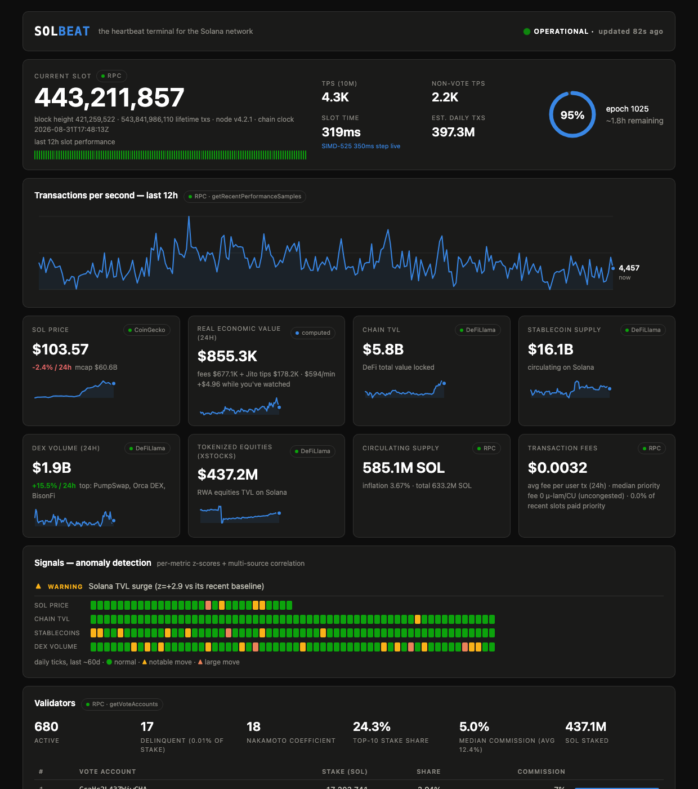

# Solbeat

**The heartbeat terminal for the Solana network.** An auto-updating report on the
state of the Solana ecosystem — zero dependencies, zero API keys, Python
standard library only.

Built for the Superteam Canada bounty *"Develop Solana Ecosystem Auto-Updating
Report & Interactive Dashboard."*

**Live dashboard: <https://andreolf.github.io/solbeat/>** — auto-refreshed
every 30 minutes by GitHub Actions. Readable report:
[report.md](https://github.com/andreolf/solbeat/blob/main/docs/report.md) ·
raw data: [data.json](https://andreolf.github.io/solbeat/data.json)



## What it produces

Every refresh generates three synchronized outputs in `docs/`:

| Output | File | What it is |
|---|---|---|
| Interactive dashboard | [`docs/index.html`](docs/index.html) | Self-contained dark-theme HTML terminal: live-ticking slot counter, REV clock, epoch ring, sparklines, status-page-style anomaly strips, validator table — no chart libraries, no CDN, works offline |
| Human-readable report | [`docs/report.md`](docs/report.md) | The full report as Markdown tables + generated analyst commentary |
| Machine-readable data | [`docs/data.json`](docs/data.json) | The complete structured snapshot (schema-versioned), including per-source provenance |

Committed samples from a real run live in [`samples/`](samples/).

## Quickstart

```bash
git clone <this repo> && cd <this repo>
python3 solbeat.py run        # collect + render (~2-4 min, one full refresh)
python3 solbeat.py serve      # ...then serve docs/ on :8017, refreshing every 30 min
```

That is the entire setup. No `pip install`, no `.env`, no API keys — Python 3.9+
and an internet connection.

## What it covers

**Network performance** — TPS (total and non-vote), measured slot time, block
height, epoch number/progress/ETA, lifetime transaction count, estimated daily
transactions, node version, cluster health, a 12-hour TPS chart and a 12-hour
slot-performance strip.

**Validators** — active vs delinquent counts, delinquent stake share, Nakamoto
coefficient, top-10/top-20 stake concentration, top validators by stake with
commission, average/median commission, total stake, and **Alpenglow readiness**:
the live share of stake that has registered BLS keys for the new consensus.

**Economic indicators** — SOL price/market cap/24h change, **Real Economic Value
(REV) computed with the Blockworks methodology** (chain base + priority fees
plus Jito MEV tips — see below), chain TVL, stablecoin supply, DEX volume with
top venues, median priority fee (+ p90 and % of slots paying), estimated average
fee per transaction, circulating supply, inflation rate.

**Ecosystem growth** — **tokenized equities** (xStocks TVL with history), a
live **program activity pulse** for flagship protocols (Jupiter, Raydium, Orca,
Pump.fun, Tensor, Magic Eden, Marinade) sampled from on-chain signatures, and
exchange reserve tracking via `getBalance` on community-attributed wallets.

**Upgrades & news** — SIMD-0525 slot-time reduction (with our own RPC
measurement as live on-chain proof the 350ms step is active), Alpenglow /
SIMD-0236 (with measured BLS-key registration), latest Agave release from
GitHub, unresolved incidents from status.solana.com, and the latest official
ecosystem headlines from solana.com's news feed.

## Bounty scope coverage

Every line of the brief, mapped to its implementation:

| Brief requirement | Where it's satisfied |
|---|---|
| Dune Analytics extraction | Optional env-gated extractor (`DUNE_API_KEY`/`DUNE_QUERY_ID`) — Dune has no keyless path, and the brief prefers zero keys; trade-off documented above |
| Key Solana ecosystem websites | solana.com news RSS (headlines), status.solana.com (incidents), GitHub (Agave releases, SIMD state); solana.com/data's headline metrics (tx counts, fees, price, stablecoins, DeFi) are reproduced from primary sources — its own backends (Dune/Allium/TopLedger) are keyed |
| Twitter accounts (announcements/sentiment) | Keyless X endpoints are dead in 2026 (documented); official announcements covered via solana.com RSS + GitHub + status page |
| RPC: `getSlot`, `getBlockTime`, `getEpochInfo`, `getRecentPerformanceSamples`, `getVoteAccounts`, `getBalance`, `getSignaturesForAddress`, `getHealth`, `getSupply` | **All nine used**, plus `getVersion`, `getInflationRate`, `getRecentPrioritizationFees` |
| DeFiLlama + CoinGecko | TVL/DEX/fees/stablecoins/xStocks + price/mcap |
| TPS, slot time, block height, epoch progress | Hero strip + 12h TPS chart + 12h slot-performance strip |
| Validator: active/delinquent, stake distribution, top validators, commission, delinquency alerts | Validators section (Nakamoto coefficient, top-10/20 share, per-validator commission, delinquent-stake alerts in the anomaly engine) |
| Ecosystem & community news | Almanac section: RSS headlines + upgrade cards + status |
| SOL price, stablecoin supply, DEX volume, REV, median fees | Economic tiles; REV computed (Blockworks methodology); median priority fee + avg fee/user-tx |
| Tokenized assets (especially equities), daily active addresses | xStocks TVL tile + history; DAA via optional Dune tile or labeled non-vote-TPS proxy |
| Upcoming upgrades (Alpenglow, SIMD-525) | Live-evidence cards: measured slot time proves SIMD-525 step 1; BLS registration measures Alpenglow readiness |
| Automation, configurable intervals | Actions cron (30 min) + `SOLBEAT_REFRESH` env; SolPulse-inspired autonomous loop |
| Anomaly detection: TPS drops/spikes, slow slots, delinquency, TVL/price moves | All implemented (z-scores + thresholds) **plus multi-source correlation** into classified incidents |
| HTML (dark) + Markdown + JSON outputs | `docs/index.html` (dark), `docs/report.md`, `docs/data.json` (schema-versioned) |
| No API keys / dependencies | Python stdlib only; zero keys end to end |
| Public repo, README, live demo, samples, write-up | This repo · [live dashboard](https://andreolf.github.io/solbeat/) · [`samples/`](samples/) · this document |

## Data sources & integration

Every endpoint is public and keyless. Each fetch is individually wrapped: a
failing source degrades gracefully and is reported honestly in the provenance
panel rather than breaking the report.

| Source | Endpoint | Used for |
|---|---|---|
| Solana mainnet RPC | `api.mainnet-beta.solana.com` | `getSlot`, `getBlockTime` (chain clock), `getEpochInfo`, `getRecentPerformanceSamples`, `getVoteAccounts`, `getSupply`, `getInflationRate`, `getRecentPrioritizationFees`, `getHealth`, `getVersion`, `getBalance` (exchange reserves), `getSignaturesForAddress` (program pulse) — every RPC method named in the bounty brief |
| CoinGecko (free) | `api.coingecko.com` | SOL price, market cap, 24h change, 30-day price series |
| DeFiLlama | `api.llama.fi`, `stablecoins.llama.fi` | Chain TVL + history, DEX volumes, chain fees/revenue, stablecoin supply + history, xStocks (tokenized equities) TVL |
| Jito Kobe | `kobe.mainnet.jito.network` | Network MEV tips per epoch (REV input) |
| Stakewiz | `api.stakewiz.com` | BLS-key registration → Alpenglow readiness |
| GitHub API | `api.github.com` | Latest Agave release; SIMD-0525 proposal state |
| solana.com | `solana.com/news/rss.xml` | Official ecosystem news headlines |
| Solana status page | `status.solana.com` | Operational status, unresolved incidents |
| Dune Analytics *(optional)* | `api.dune.com` | Latest results of any Dune query (e.g. daily active addresses) — enabled by setting `DUNE_API_KEY` + `DUNE_QUERY_ID`; off by default because Dune has no keyless path and Solbeat's core design is zero-key |

**On the two gated sources:** Dune requires an API key for every access path
(API and embeds), so its extractor ships as the one *optional*, env-gated
integration — the zero-key default stays intact. X/Twitter's keyless endpoints
(syndication CDN, nitter) are dead in 2026; official announcements are covered
instead via solana.com's news RSS, the GitHub releases/SIMD tracker, and the
status page. Daily active addresses has no keyless source (Solscan, Dune, and
Blockworks all gate it): with a Dune key configured it appears as a first-class
tile; without one, non-vote TPS is shown as the transparent, honestly-labeled
activity proxy.

### REV methodology

`REV(24h) = chain base+priority fees (DeFiLlama dailyFees) + Jito MEV tips`.
Tips are Kobe's per-epoch total, converted to a daily rate using the *measured*
slot time, priced at spot. This follows the Blockworks Research definition of
Real Economic Value and is labeled as computed wherever it appears.

## Automation strategy

- **GitHub Actions** ([`.github/workflows/solbeat.yml`](.github/workflows/solbeat.yml))
  runs `python3 solbeat.py run` every 30 minutes, commits `docs/`, and GitHub
  Pages serves the dashboard — a fully autonomous loop with zero
  infrastructure and zero secrets.
- **Self-hosted option:** `python3 solbeat.py serve` does the same loop locally
  with `http.server`. The refresh interval is configurable without touching
  code: `SOLBEAT_REFRESH=600 python3 solbeat.py serve` (seconds); the Actions
  cadence is one cron line.
- The dashboard needs no server-side rendering at view time: JS animates the
  slot counter (from measured slot time), the REV clock, and the data-age
  indicator between refreshes, so a 30-minute cadence still *feels* live.
- Rolling cross-run history (`docs/history.json`, capped) feeds the anomaly
  baselines and the run-history strip; it grows automatically with each cycle.

## Anomaly detection

Two layers:

1. **Per-metric scoring** — z-scores against the best available baseline for
   each metric: TPS and slot time against the last ~12h of RPC performance
   samples; price/TVL/stablecoins/DEX volume against their 30–90 day daily
   series (fetched from source history, so detection works from the very first
   run); REV against the cross-run history. Absolute-threshold rules cover
   delinquent stake share, slow slots, and >10% daily SOL moves.
2. **Multi-source correlation** — co-firing signals are classified into named
   incidents with plain-language narratives: *network incident* (throughput
   anomaly + slow slots/delinquency), *consensus stress*, *market-wide move*
   (price + liquidity), *liquidity rotation* (stablecoins + TVL moving
   together). A TPS drop that coincides with a delinquency spike is a different
   story than a quiet Sunday, and the report says which one it is.

Findings render as status-page-style tick strips (60 days per market metric,
12h for slot performance, plus the run-history strip) — the most instantly
readable anomaly visualization there is.

## Design notes

- **Single-file outputs, no build step.** The HTML embeds all CSS/JS/SVG; charts
  are server-side-generated SVG. It renders identically from a file:// URL.
- **Provenance everywhere.** Every tile carries a source badge (hover: endpoint,
  fetch time, latency); the footer table reports each source's status honestly.
- **Dark theme** on a validated palette; status colors are reserved for status,
  identity never rides on color alone (icons + labels accompany every signal).
- Text/labels never wear data colors; tables use tabular numerals; the layout is
  responsive down to mobile widths.

## Repository layout

```
solbeat.py          # collectors, derived metrics, anomaly engine, MD/JSON renderers, CLI
solbeat_html.py     # HTML dashboard renderer (SVG charts, strips, live JS layer)
docs/               # generated site (Pages root): index.html, report.md, data.json, history.json
samples/            # committed sample outputs from a real run
.github/workflows/  # the 30-minute refresh loop
```

## License

MIT — see [LICENSE](LICENSE).
